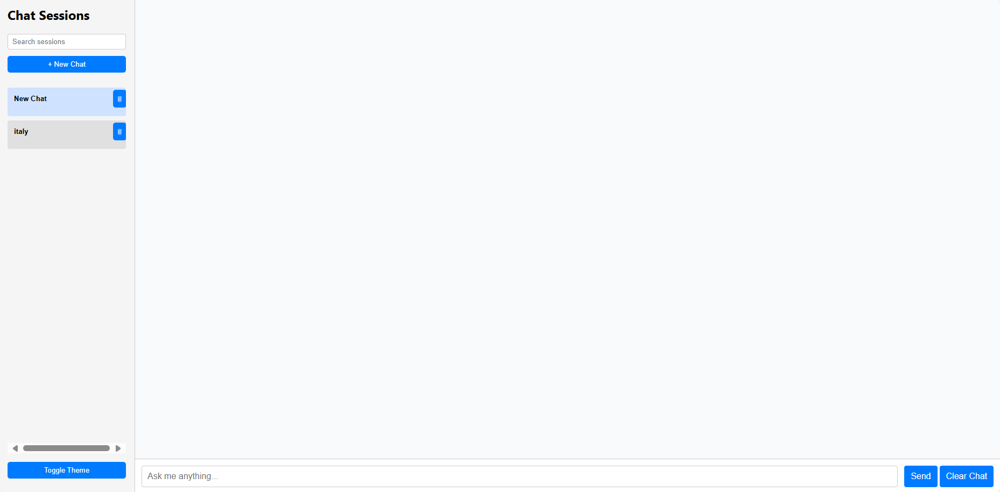

# ai-chat-agent

# 🧠 LLaMA Chat Agent

An AI-powered chat application with session history, auto-title generation, dark theme toggle, and backend integration using LLaMA models or your preferred API.

## 📸 Preview



---

## ⚙️ Features

- ✅ Stream AI responses with typing effect
- ✅ Save chat history locally (persists after reload)
- ✅ Multi-session support
- ✅ Rename/Delete sessions
- ✅ Search across sessions
- ✅ Toggle light/dark theme
- ✅ Powered by your custom backend or LLaMA API

---

## 🚀 Getting Started

### Frontend Setup

```bash
cd frontend
npm install
npm start
```

### Backend Setup
```bash
Copy
Edit
cd backend
pip install -r requirements.txt
uvicorn main:app --reload
```
### 🧩 Tech Stack
- React

- FastAPI

- LLaMA / Open Source LLM APIs

- Tailwind (optional for styling)

- React Markdown

### 🧠 How it Works
- Each user interaction is saved under a unique session. Sessions are auto-titled using the first user query. You can rename or delete them anytime.
